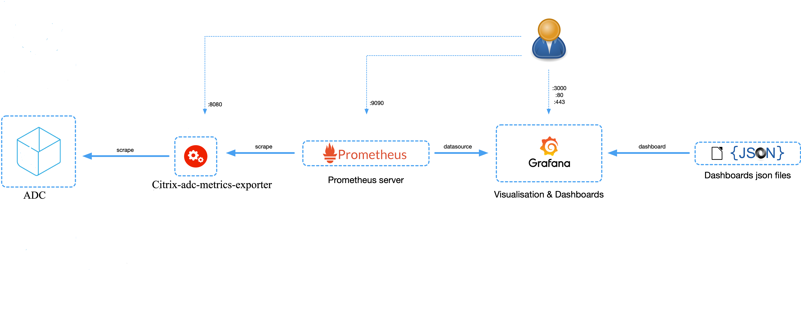
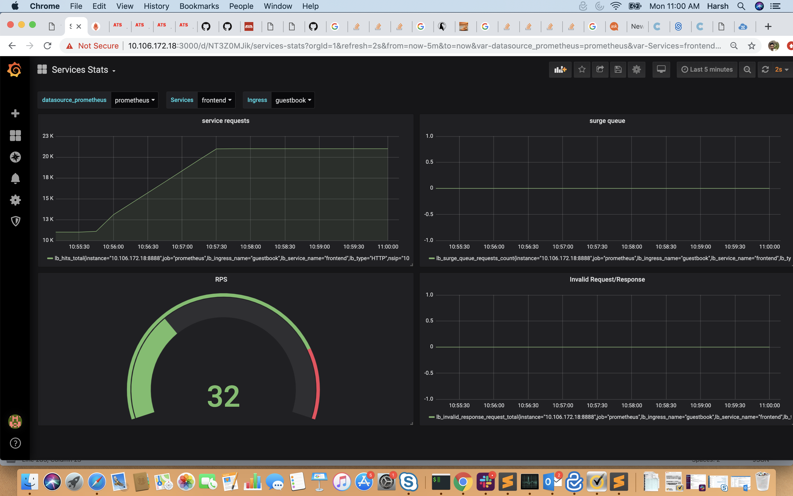

Exporter for Citrix ADC (NetScaler) Stats
===

Description:
---

This is a simple server that scrapes [Citrix ADC](https://www.citrix.com/products/citrix-adc/) stats and exports them via HTTP to [Prometheus](https://github.com/prometheus). Prometheus can then be added as a data source to Grafana to view the Citrix ADC stats graphically.


 
To monitor stats and counters of Citrix ADC instances, citrix-adc-metric-exporter can be run as a container or script. It collects Citrix ADC stats such as total hits to a vserver, http request rate, ssl encryption-decryption rate, etc from the Citrix ADC instances and holds them until the Prometheus server pulls the stats and stores them with a timestamp. Grafana can then be pointed to the Prometheus server to fetch the stats, plot them, set alarms, create heat maps, generate tables, etc as needed to analyse the Citrix ADC stats. 

   Details about setting up the exporter to work in an environment as given in the figure is provided in the following sections. A note on which Citrix ADC entities/metrics the exporter scrapes by default and how to modify it is also explained.

#### Participate:

   You can discuss bugs/feature requests on our Slack channel. To request an invitation to participate in the Citrix ADC Cloud Native Slack channel(citrixadccloudnative.slack.com), please supply your email address using this form: https://podio.com/webforms/22979270/1633242

## Release notes

Click [here](https://github.com/citrix/citrix-adc-metrics-exporter/releases) for the release notes of the latest Citrix adc metrix exporter release

Usage:
---
The exporter can be run as a standalone python script, built into a container or run as a pod in Kubernetes. The corresponding drop-downs explain how to deploy it in each of the manners.

<details>
<summary>Usage as a Python Script</summary>
<br>

To use the exporter as a python script, the ```prometheus_client``` and ```requests``` package needs to be installed. This can be done using 
```
pip install prometheus_client
pip install requests
pip install PyYAML
pip install retrying
```
Now, create a folder ```/exporter``` and copy the ```metrics.json``` file to the folder. 
Finally, the exporter can be run as a python script using;
```
nohup python exporter.py [flags] &
```
where the flags are:

flag&nbsp;&nbsp;&nbsp;&nbsp;&nbsp;&nbsp;&nbsp;&nbsp;&nbsp;&nbsp;&nbsp;&nbsp;&nbsp;&nbsp;&nbsp;&nbsp;&nbsp;&nbsp; | Description
-----------------|--------------------
--target-nsip    | Provide the &lt;IP&gt; of the Citrix ADC to be monitored
--port	         | Specify on which port metrics collected by the exporter should be exposed. Agents like Prometheus will need to scrape this port of the container to collected metrics
--metric         | Provide a specific metric to load from metrics.json file (eg: 'lbvserver', 'protocolhttp', etc). If not provided, all metric entities from metrics.json will be loaded
--secure         | Ensures HTTPS connection to ADC. Option 'no'(HTTP) can be provided to collect metrics from Citrix ADC. Default: 'yes'.
--start-delay    | Specify time for which exporter should sleep before starting metric collection. Default: 10s
--timeout        | Specify timeout period for exporter to obtain response from target Citrix ADCs. Default: 15s
--metrics-file   | The location of metrics.json file. Default: /exporter/metrics.json
--log-file       | The location of exporter.log file. Default: /exporter/exporter.log
--log-level      | The level of logging. DEBUG, INFO, WARNING, ERROR or CRITICAL Default: DEBUG
--config-file    | File with configs such as ```username```, ```password```, ```validate-cert```, ```cacert-path```, etc. Helps supply username and password through file rather than CLI.
--validate-cert. | Specify if ca certifcate is to be validated to access Citrix ADC. Default: 'no'. Valid value: 'yes'
--cacert-path.   | Provide valid cert path if "-validate-cert" set to 'yes'. cert path will only be considered if '--validate-cert' is set to 'yes'.
--k8sCICprefix   | Provide the prefix if exporter is used in kubernetes enviroment with Citrix ingress controller, "k8s_ingress_service_stats" dashboard can be used only if correct CICprefix is provided and CIC version is 1.2.0 and above. Default prefix is "K8s"  

The exporter can be setup as given in the diagram using;
```
nohup python exporter.py --target-nsip=10.0.0.1 --port 8888 --config-file=config.yaml &
```
This directs the exporter container to scrape 10.0.0.1 IP, and the expose the stats it collects on port 8888.

File 'config.yaml' should contain username and password of the ADC to which exporter connects to. For reference, refer config.yaml.example which specifies the format for providing the login credentials. 

Login credentials can also be provided using environment variables using NS_USER, NS_PASSWORD.Though config file input is the preferred method for security concerns.

The user can then access the exported metrics directly thorugh port 8888 on the machine where the exporter is running, or Prometheus and Grafana can be setup to view the exported metrics though their GUI.

### Additionals:
As an optional configuration, Citrix ADC exporter allows you to validate the SSL server certificate provided by Citrix ADC. 

For this:

-- In config.yaml, '--validate-cert' option should be set to 'yes', and certificate path should be provided using'--cacert-path' argument. 

-- Please confirm that certificate and '--cert-path' provided is valid.

-- Additionaly, '--validate-cert(default='no')' and '--secure(default='yes')' options should be set to 'yes'.


</details>


<details>
<summary>Usage as a Container</summary>
<br>

In order to use the exporter as a container, the image ```quay.io/citrix/citrix-adc-metrics-exporter:1.4.4``` will need to be pulled using;
```
docker pull quay.io/citrix/citrix-adc-metrics-exporter:1.4.4
```
**NOTE:** It can also be build locally using ```docker build -f Dockerfile -t <image_name>:<tag> ./```

Now, the exporter can be run using:
```
docker run -dt -p <host_port>:<container_port> --mount type=bind,source=<host-path-for-config-file>,target=/exporter/config.yaml quay.io/citrix/citrix-adc-metrics-exporter:1.4.4 [flags] --config-file=/exporter/config.yaml
```
where the flags are:

flag&nbsp;&nbsp;&nbsp;&nbsp;&nbsp;&nbsp;&nbsp;&nbsp;&nbsp;&nbsp;&nbsp;&nbsp;&nbsp;&nbsp;&nbsp;&nbsp;&nbsp;&nbsp; | Description
-----------------|--------------------
--target-nsip    | Provide the &lt;IP&gt; of the Citrix ADC to be monitored
--port	         | Specify on which port metrics collected by the exporter should be exposed. Agents like Prometheus will need to scrape this port of the container to collected metrics
--metric         | Provide a specific metric to load from metrics.json file (eg: 'lbvserver', 'protocolhttp', etc). If not provided, all metric entities from metrics.json will be loaded
--secure         | Ensures HTTPS connection to ADC. Option 'no'(HTTP) can be provided to collect metrics from Citrix ADC. Default: 'yes'.
--start-delay    | Specify time for which exporter should sleep before starting metric collection. Default: 10s
--timeout        | Specify timeout period for exporter to obtain response from target Citrix ADC. Default: 15s
--metrics-file   | The location of metrics.json file. Default: /exporter/metrics.json
--log-file       | The location of exporter.log file. Default: /exporter/exporter.log
--log-level      | The level of logging. DEBUG, INFO, WARNING, ERROR or CRITICAL Default: DEBUG
--config-file    | File with configs such as ```username```, ```password```, ```validate-cert``, ```cacert-path```, etc. Helps supply username and password through file rather than CLI for secure deployment.
--validate-cert  | Specify if ca certifcate is to be validated to access Citrix ADC. Default: 'no'. Valid value: 'yes'
--cacert-path    | Provide valid cert path if "--validate-cert" set to 'yes'. cert path will only be considered if '--validate-cert' is set to 'yes'.
--k8sCICprefix   | Provide the prefix if exporter is used in kubernetes enviroment with Citrix ingress controller, "k8s_ingress_service_stats" dashboard can be used only if correct CICprefix is provided and CIC version is 1.2.0 and above. Default prefix is "K8s"  


To setup the exporter as given in the diagram, the following command can be used:
```
docker run -dt -p 8888:8888 --mount type=bind,source=/path/to/config.yaml,target=/exporter/config.yaml --name citrix-adc-exporter quay.io/citrix/citrix-adc-metrics-exporter:1.4.4 --target-nsip=10.0.0.1 --port=8888 --config-file=/exporter/config.yaml
```
This directs the exporter container to scrape the 10.0.0.1 IP, and the expose the stats it collects on port 8888.

File 'config.yaml' should contain username and password of the ADC to which exporter connects to. For reference, refer config.yaml.example which specifies the format for providing the login credentials. Config.yaml file then needs to be mounted to the container at fixed target specified('/exporter/config.yaml') only.

Login credentials can also be provided using environment variables using NS_USER, NS_PASSWORD.Though config file input is the preferred method for security concerns.

The user can then access the exported metrics directly thorugh port 8888 on the machine where the exporter is running, or Prometheus and Grafana can be setup to view the exported metrics though their GUI.

**NOTE:** In the command above, the value of the ```--port``` flag should be the same as the ```container_port```.


### Additionals:
As an optional configuration, Citrix ADC exporter allows you to validate the SSL server certificate provided by Citrix ADC.

For this:

-- In config.yaml, '--validate-cert' option should be set to 'yes', and certificate path should be provided using'--cacert-path' argument.

-- Please confirm that certificate and '--cert-path' provided is valid. 

-- Additionaly, '--validate-cert(default='no')' and '--secure(default='yes')' options should be set to 'yes' for certificate to be considered.

Certificate should then be mounted at the '--cacert-path' provided. For instance, if cert is 'cacert.pem' and '--cacert-path' provided in 'config.yaml' is '/exporter/cacert.pem'

```
docker run -dt -p 8888:8888 --mount type=bind,source=/path/to/config.yaml,target=/exporter/config.yaml --mount type=bind,source=/path/to/cacert.pem,target=/exporter/cacert.pem --name citrix-adc-exporter quay.io/citrix/citrix-adc-metrics-exporter:1.4.4 --target-nsip=10.0.0.1 --port=8888 --config-file=/exporter/config.yaml
``` 
Cert validation options can also be provided using environment variables using NS_VALIDATE_CERT, NS_CACERT_PATH. Thoughconfig file input is the preferred method.


</details>


<details>
<summary>Run the exporter as a Pod in Kubernetes</summary>
<br>

To provide the login credentials to access ADC, create a secret and mount the volume at mountpath "/mnt/nslogin".  
```
kubectl create secret generic nslogin --from-literal=username=<citrix-adc-user> --from-literal=password=<citrix-adc-password> -n <namespace>
```

The following yaml file can be used to deploy the exporter as a pod in Kuberenetes and expose it as a service. Here, the necessary flags are provided as a list in the ```args:``` section of the yaml file.
```
apiVersion: v1
kind: Pod
metadata:
  name: exporter
  labels:
    app: exporter
spec:
  containers:
    - name: exporter
      image: quay.io/citrix/citrix-adc-metrics-exporter:1.4.4
      args:
        - "--target-nsip=10.0.0.1"
        - "--port=8888"
      imagePullPolicy: Always
      volumeMounts:
      - name: nslogin
        mountPath: "/mnt/nslogin"
        readOnly: true
      securityContext:
        readOnlyRootFilesystem: true
  volumes:
  - name: nslogin
    secret:
      secretName: nslogin
---
apiVersion: v1
kind: Service
metadata:
  name: exporter
  labels:
    app: exporter
spec:
  type: ClusterIP
  ports:
  - port: 8888
    targetPort: 8888
    name: exporter-port
  selector:
    app: exporter
```

Login Credentials can also be provided using environment variables NS_USER, NS_PASSWORD. Though, secret volume is the preffered method for security.

Flags which can be provided to the exporter in the ```args:``` section are:

flag&nbsp;&nbsp;&nbsp;&nbsp;&nbsp;&nbsp;&nbsp;&nbsp;&nbsp;&nbsp;&nbsp;&nbsp;&nbsp;&nbsp;&nbsp;&nbsp;&nbsp;&nbsp; | Description
-----------------|--------------------
--target-nsip    | Provide the &lt;IP&gt; of the Citrix ADC to be monitored
--port	         | Specify on which port metrics collected by the exporter should be exposed. Agents like Prometheus will need to scrape this port of the container to collected metrics
--metric         | Provide a specific metric to load from metrics.json file (eg: 'lbvserver', 'protocolhttp', etc). If not provided, all metric entities from metrics.json will be loaded
--secure         | Ensures HTTPS connection to ADC. Option 'no'(HTTP) can be provided to collect metrics from Citrix ADC. Default: 'yes'.
--start-delay    | Specify time for which exporter should sleep before starting metric collection. Default: 10s
--timeout        | Specify timeout period for exporter to obtain response from target Citrix ADC. Default: 15s
--metrics-file   | The location of metrics.json file. Default: /exporter/metrics.json
--log-file       | The location of exporter.log file. Default: /exporter/exporter.log
--log-level      | The level of logging. DEBUG, INFO, WARNING, ERROR or CRITICAL Default: DEBUG
--config-file    | File with configs such as ```username```, ```password```, ```validate-cert```, ```cacert-path```, etc. Helps supply username and password through file rather than CLI.
--validate-cert  | Specify if ca certifcate is to be validated to access Citrix ADC. Default: 'no'. Valid value: 'yes'
--cacert-path    | Provide valid cert path if "--validate-cert" set to 'yes'. cert path will only be considered if '--validate-cert' is set to 'yes'.
--k8sCICprefix   | Provide the prefix if exporter is used in kubernetes enviroment with Citrix ingress controller, "k8s_ingress_service_stats" dashboard can be used only if correct CICprefix is provided and CIC version is 1.2.0 and above. Default prefix is "K8s"  


### Additionals:
As an optional configuration, Citrix ADC exporter allows you to validate the SSL server certificate provided by Citrix ADC. For this:
User need to first mount the secret at any valid path inside pod. For instance, for CA certificate 'cacert.pem' and name give as 'exp-ca-cert'

```
kubectl create secret generic exp-ca-cert --from-file=./cacert.pem"
```

-- In args section of yaml, '--validate-cert' option should be set to 'yes', and certificate path should be provided using'--cacert-path' argument.

-- Please confirm that mounted certificate and '--cert-path' provided are valid. 

-- Additionaly, '--validate-cert(default='no')' and '--secure(default='yes')' options should be set to 'yes' for certificate to be considered.
 
```
apiVersion: v1
kind: Pod
metadata:
  name: exporter
  labels:
    app: exporter
spec:
  containers:
    - name: exporter
      image: quay.io/citrix/citrix-adc-metrics-exporter:1.4.4
      args:
        - "--target-nsip=10.0.0.1"
        - "--port=8888"
        - "--validate-cert=yes"
        - "--cacert-path=/mnt/certs/cacert.pem"
      imagePullPolicy: Always
      volumeMounts:
      - name: nslogin
        mountPath: "/mnt/nslogin"
        readOnly: true
      - name: exp-ca-cert
        mountPath: "/mnt/certs/"
        readOnly: true
      securityContext:
        readOnlyRootFilesystem: true
  volumes:
  - name: nslogin
    secret:
      secretName: nslogin
  - name: exp-ca-cert
    secret:
      secretName: exp-ca-cert
---
apiVersion: v1
kind: Service
metadata:
  name: exporter
  labels:
    app: exporter
spec:
  type: ClusterIP
  ports:
  - port: 8888
    targetPort: 8888
    name: exporter-port
  selector:
    app: exporter
```
Cert Credentials can also be provided using environment variables NS_VALIDATE_CERT, NS_CACERT_PATH instead of args '--validate-cert', '--cacert-path' respectively.


</details>

<details>
<summary>Automatically monitor workloads in Kubernetes using Citrix ADC and Prometheus Operator</summary>
<br>
When the Citrix ADC is used as an Ingress to workloads in a Kubernetes, cluster, you can use the exporter along with the Prometheus Operator (https://github.com/coreos/prometheus-operator) to automatically monitor new workloads as they are deployed. https://developer-docs.citrix.com/projects/citrix-k8s-ingress-controller/en/latest/metrics/promotheus-grafana/
</details>

Citrix ADC configuration:
---
It is preferable to create specific user for data scraping from Citrix ADC with permissions to stats data only.

<details>
<summary>Citrix ADC config example</summary>

```
# Create a new Command Policy which is only allowed to run the stat command
add system cmdPolicy stats-policy ALLOW (^stat.*|show ns license|show serviceGroup|show ssl certKey)

# Create a new user  
# Change the 'password' in accordance with your password policy
add system user stats-user "password" -externalAuth DISABLED 

# Bind the local user account to the created Command Policy
bind system user stats-user stats-policy 100
```

</details>

Stats Exported by Default:
---

The exporter is configured to export some of the most commonly used stats for a Citrix ADC device. They are mentioned in the ```metrics.json``` file and summarized in the table below:

Sl. No. |     STATS                 | NS nitro name
--------|---------------------------|--------------
1       | LB vserver stats          | "lbvserver"
2       | CS vserver stats          | "csvserver"
3       | HTTP stats                | "protocolhttp"
4       | TCP stats                 | "protocoltcp"
5       | IP stats                  | "protocolip"
6       | SSL stats                 | "ssl"
7       | Interface stats           | "Interface" (capital 'i')
8       | Service stats             | "service"
9       | Service group stats       | "services"
10      | Bandwidth Capacity stats  | "nscapacity"
11      | SSL vserver stats         | "sslvserver"
12      | System info stats         | "system"
13      | System cpu stats          | "systemcpu"
14      | AAA stats                 | "aaa"


Exporting Additional Stats which are not Included by Default:
---

In this document, the term 'entity' has been used to refer to Citrix ADC entities such as HTTP, Interfaces, LB, etc. The term 'metrics' has been used to refer to the stats collected for these entities. For example,
the entity ```lbvserver``` has metrics such as ```totalpktsent```, ```tothits```, ```requestsrate```, etc. These metrics are classified by Prometheus into two categories -- ```counters``` and ```gauges``` as per this [link](https://prometheus.io/docs/concepts/metric_types/).   

Metrics whose value can only increase with time are called counters and those which can increase or decrease are called gauges. For the example of ```lbvserver```, ```totalpktsent``` and ```tothits``` are counters, while ```requestsrate``` is a gauge. 
Accordingly, entities and their metrics have been provided in the ```metrics.json``` file. By modifying ```metrics.json```, new entities and their metrics which are not exported by default can be included. 
For example, to  export ```aaa``` stats, the lines given between ```-.-.-.-``` can be added as follows:

<details>
<summary>metrics.json</summary>
<br>

```
{
    "system": {
        "counters": [
            ["numcpus", "citrixadc_cpu_number"]
        ],

        "gauges": [
            ["cpuusagepcnt", "citrixadc_cpu_usage_percent"],
            ["mgmtcpuusagepcnt", "citrixadc_cpu_management_cpu_usage_percent"],
            ["pktcpuusagepcnt", "citrixadc_cpu_packet_cpu_usage_percent"],
            ["rescpuusagepcnt", "citrixadc_cpu_res_cpu_usage_percent"]
        ]
    },

-.-.-.-.-.-.-.-.-.-.-.-.-.-.-.-.-.-.-.-.-.-.-.-.-.-.-.-.-.-.-.-.-.-.-.-.-.-.-.-.-.-.-.-.
    "aaa": {
            "counters": [
                ["aaatotsessions", "citrixadc_aaa_tot_sessions"],
                ["aaatotsessiontimeout", "citrixadc_aaa_tot_session_timeout"]
            ],
            "gauges": [
                ["aaasessionsrate', 'citrixadc_aaa_sessions_rate"],
                ["aaasessiontimeoutrate ', 'citrixadc_aaa_session_timeout_rate"]
            ]
      },
-.-.-.-.-.-.-.-.-.-.-.-.-.-.-.-.-.-.-.-.-.-.-.-.-.-.-.-.-.-.-.-.-.-.-.-.-.-.-.-.-.-.-.-.

    "protocolhttp": {
        "counters": [
            ["httptotrequests", "citrixadc_http_tot_requests"],
            ["httptotresponses", "citrixadc_http_tot_responses"],
            ["httptotposts", "citrixadc_http_tot_posts"],
            ["httptotgets", "citrixadc_http_tot_gets"],
            ...
            ...
            ["httptotchunkedrequests", "citrixadc_http_tot_chunked_requests"]
        ],

        "gauges": [
            ["httprequestsrate", "citrixadc_http_requests_rate"],
            ["spdystreamsrate", "citrixadc_http_spdy_streams_rate"],
            ...
            ...
            ["http11responsesrate", "citrixadc_http_11_responses_rate"]
        ]
    },

    "lbvserver": {
        "counters": [
            ["totalpktssent", "citrixadc_lb_packets_sent_total"],
            ["tothits", "citrixadc_lb_hits_total"],
            ["totalrequestbytes", "citrixadc_lb_request_bytes_total"],
            ...
            ... 
            ["totalresponsebytes", "citrixadc_lb_response_bytes_received_total"]
        ],

        "gauges": [
            ["requestbytesrate", "citrixadc_lb_request_rate_bytes"],
            ["requestsrate", "citrixadc_lb_request_rate"],
            ...
            ...
            ["inactsvcs", "citrixadc_lb_inactive_services_count"]
        ],

        
            ["name", "citrixadc_lb_name"],
            ["type", "citrixadc_lb_type"],
        ]
    },

...
...
...
}

```

</details>
<br>


On a given Citrix ADC, some entities such as lbvserver, csvserver, interfaces, etc can have multiple instances of that entity configured, each having its own name. Such entities have an additional structure in ```metrics.json``` called ```label```.
A label is used for such entities to differenciate stats among different instances of that entity based on name, ip, type, or any other suitable characteristic of that entitiy. 
Other entities such as http, tcp, ssl are present as a single global parameter for the Citrix ADC, and thus do not have a ```label``` section in ```metrics.json```.

Verification of Exporter Functionality
---
To verify if the exporter is scraping and exporting stats from Citrix ADC instances, the following url can be opened on a web browser or curl command can be fired from CLI:
```
http://<hostIP>:<port>
curl http://<hostIP>:<port>
```
where ```hostIP``` is the IP of the host on which the python script or container is running, and ```port``` is the value of the ```--port``` flag which had been provided (```8888``` as per the example). All the stats for all the entities configured on the Citrix ADC and provided in ```metrics.json``` should appear along with their live values. An example response would be as follows;

<details>
<summary>Sample Output</summary>
<br>

```
# HELP http_tot_rx_packets tcptotrxpkts
# TYPE http_tot_rx_packets counter
http_tot_rx_packets{nsip="10.0.0.1"} 2094931640.0
# HELP tcp_tot_rx_bytes tcptotrxbytes
# TYPE tcp_tot_rx_bytes counter
tcp_tot_rx_bytes{nsip="10.0.0.1"} 735872803514.0
# HELP tcp_tx_bytes tcptottxbytes
# TYPE tcp_tx_bytes counter
tcp_tx_bytes{nsip="10.0.0.1"} 249210838820.0
# HELP tcp_tot_tx_packets tcptottxpkts
# TYPE tcp_tot_tx_packets counter
tcp_tot_tx_packets{nsip="10.0.0.1"} 2082562915.0
# HELP tcp_tot_client_connections_opened tcptotclientconnopened
# TYPE tcp_tot_client_connections_opened counter
tcp_tot_client_connections_opened{nsip="10.0.0.1"} 35606929.0
ip_tot_bad_mac_addresses{nsip="10.0.0.1"} 0.0
# HELP ip_rx_packers_rate iprxpktsrate
# TYPE ip_rx_packers_rate gauge
ip_rx_packers_rate{nsip="10.0.0.1"} 17703.0
# HELP ip_rx_bytes_rate iprxbytesrate
# TYPE ip_rx_bytes_rate gauge
ip_rx_bytes_rate{nsip="10.0.0.1"} 5797562.0
# HELP ip_tx_packets_rate iptxpktsrate
# TYPE ip_tx_packets_rate gauge
ip_tx_packets_rate{nsip="10.0.0.1"} 18119.0
# HELP ip_bytes_rate iptxbytesrate
# TYPE ip_bytes_rate gauge
ip_bytes_rate{nsip="10.0.0.1"} 1038524.0
# HELP services_tot_requests totalrequests
# TYPE services_tot_requests counter
services_tot_requests{nsip="10.0.0.2",service_ip="20.0.0.56",servicegroup_name="svcgrp"} 10.0
services_tot_requests{nsip="10.0.0.2",service_ip="20.0.0.57",servicegroup_name="svcgrp"} 11.0
services_tot_requests{nsip="10.0.0.2",service_ip="20.0.0.60",servicegroup_name="svcgrp2"} 4.0
# HELP services_tot_response_bytes totalresponsebytes
# TYPE services_tot_response_bytes counter
services_tot_response_bytes{nsip="10.0.0.2",service_ip="20.0.0.56",servicegroup_name="svcgrp"} 2320.0
services_tot_response_bytes{nsip="10.0.0.2",service_ip="20.0.0.57",servicegroup_name="svcgrp"} 2552.0
services_tot_response_bytes{nsip="10.0.0.2",service_ip="20.0.0.60",servicegroup_name="svcgrp2"} 936.0
# HELP services_tot_request_bytes totalrequestbytes
# TYPE services_tot_request_bytes counter
services_tot_request_bytes{nsip="10.0.0.2",service_ip="20.0.0.56",servicegroup_name="svcgrp"} 860.0
services_tot_request_bytes{nsip="10.0.0.2",service_ip="20.0.0.57",servicegroup_name="svcgrp"} 946.0
services_tot_request_bytes{nsip="10.0.0.2",service_ip="20.0.0.60",servicegroup_name="svcgrp2"} 344.0
```

</details>
<br>

Stats (of counter and gauge type) for enities such as http, tcp, ip, and service_groups is seen in the example response given above. Labels attached to each stat appear in the curly braces ```{}``` next to the stat name.


Prometheus and Grafana Integration
---
This section describes how to bring up basic Prometheus and Grafana containers to provide an end to end data collection and visualization setup. 


<details>
<summary>Setup of Prometheus</summary>
<br>

These steps can be followed to setup a Prometheus container:
1. Pull the docker image: ```docker pull prom/prometheus```.

2. Create the ```prometheus.cfg``` file as given below, and providie the Exporter's IP and Port in the place of ```<EXPORTER_IP>``` and ```<EXPORTER_PORT>```. For example, the targets line might read ```- targets: ['10.100.200.3:8888']```.
```
global:
  scrape_interval: 15s
  scrape_timeout:  10s

  external_labels:
    monitor: 'prometheus-monitor'

scrape_configs:
- job_name: prometheus

  static_configs:
  - targets: ['<EXPORTER_IP>:<EXPORTER_PORT>']
```

3. Run the Prometheus container while providing the location of the ```prometheus.cfg``` file created in the above step: <br> 
```docker run -dt -p 9090:9090 -v /path/to/prometheus.cfg:/etc/prometheus/prometheus.cfg prom/prometheus:latest --config.file=/etc/prometheus/prometheus.cfg```

4. VERIFICATION: Go to the Prometheus web page and under the "Status" dropdown select "Targets". The exporter should appear as a target and in a few minutes time, must come up in ```UP``` state. This means that Prometheus is able to collect stats from the Exporter.

</details>
<br>


<details>
<summary>Setup of Grafana</summary>
<br>

The steps bellow can be followed to setup up a Grafana container with a sample dashboard.

1. Pull grafana image: ```docker pull grafana/grafana:latest```

2. Run grafana container: ```docker run -dt -p 3000:3000 grafana/grafana:latest```

3. Import any of the sample grafana dashboard files: Login to Grafana using admin:admin, from the column on the left select the ```+``` symbol, select "Import", and select "upload .json file". Now, navigate to and upload "sample_service_stats.json" or "sample_system_stats.json".


4. To start seeing graphs and values in the dashboard, add the Prometheus datasource(s) to Grafana. While adding the datasource, ensure the name of the Prometheus datasource starts with the word "prometheus" (eg. prometheus_datasource1). Once added, datasources starting with the word "prometheus" will automatically get detected in the dropdown filters of the dashboard. 


5. Usage of Dashboard: For K8s CIC set up(providing K8sCICPrefix), with "k8s_cic_ingress_services_stats.json",dashboard shows service requests, surque queue, RPS and Invalid Request/Response. User can select any of the configured ingress  and then apply filter for a given ingress from the drop down menu for ingress.Fro non-k8s setup, one can use "sample_lb_stats.json" for all lbvservers configured on ADC for some counters. And with "sample_system_stats.json", dashboard shows CPU utilization, Memory Utilization and bandwidth capacity utilization where user can also set an alert. The dashboard can be expanded to include graphs of any other stats which the exporter is collecting. For more information on modifying the Grafana dashboard, please take a look at their [documentation](http://docs.grafana.org/) or demo [videos](https://www.youtube.com/watch?v=mgcJPREl3CU).

 

</details>
<br>


Troubleshooting:
---

<details>
<summary>1. Grafana dashboard has no plots</summary>
<br>

If the graphs on the Grafana dashboards do not have any values plotted (not even a flat '0' value line), this means that Grafana is unable to obtain stats from its datasource. The following can be done:

		
i. Check if the prometheus datasource is saved and working properly. On saving the datasource after providing the Name and IP, a "Data source is working" message should appear in green indicating the datasource is reachable and detected.
		
ii. If the dashboard was created using ```sample_grafana_dashboard.json```, ensure the name given to the Prometheus datasource begins with the word "prometheus", with all lowercase letters.
		
iii. Check the Targets page of prometheus to see if the requried target exporter is in ```DOWN``` state.

</details>
<br>

<details>
<summary>2. DOWN: Context deadline exceeded</summary>
<br>

If this appears against any of the exporter target of Prometheus, this means that Prometheus is unable to connect to that exporter, or is unable to fetch all the metrics from that exporter within the given ```scrape_timeout```.


i. If Prometheus Operator is being used ```scrape_timeout``` is usually adjusted automatically and such an error means that the exporter itself is not reachable
		
ii. If a standalone Promtheus container/pod is being used, try increasing the ```scrape_interval``` and ```scrape_timeout``` in the ```/etc/prometheus/prometheus.cfg``` file to allow for more time to collect the metrics.
		

</details>
<br>
      

<details>
<summary>3. Empty values next to metric names</summary>
<br>

It may be observed that some metrics are being received by Prometheus but have no value associated with them. This means that that the exporter is unable to collect that particular metric from the Citrix ADC. It could be either becuase:

	
i. The device provided as a ```--target-nsip``` is reachable on the IP and port but is not a Citrix ADC, or
	
ii. The metric being fetched does not exist in the Citrix ADC. Possibly due to it being an invalid metric name.
		
</details>
<br>
		

**NOTE:** The exporter is designed to catch and handle all exceptions that could arise duriing its operation. This is a requirement for the [Citrix Ingress Controller's](https://github.com/citrix/citrix-k8s-ingress-controller) [metrics-visualizer](https://github.com/citrix/citrix-k8s-ingress-controller/tree/master/metrics-visualizer). To debug errors the exporter might have run into, provide the ```--log-level=DEBUG``` flag.

